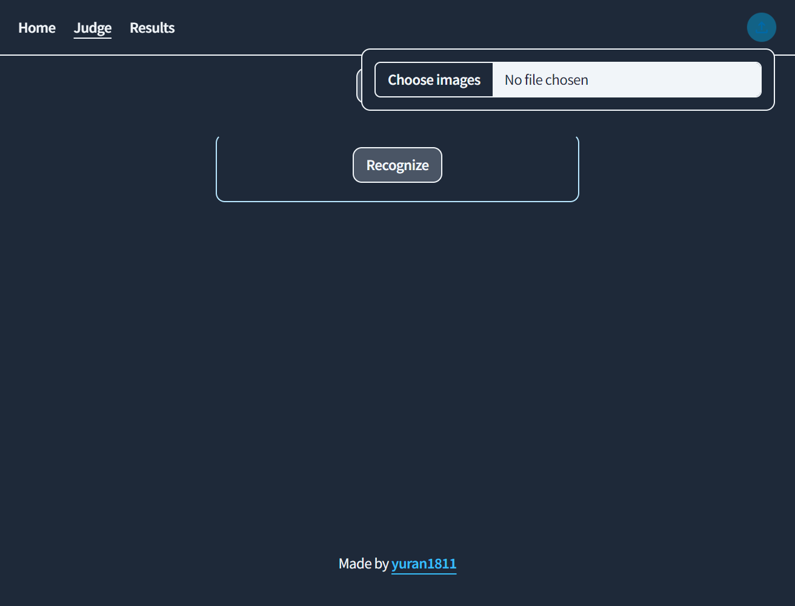
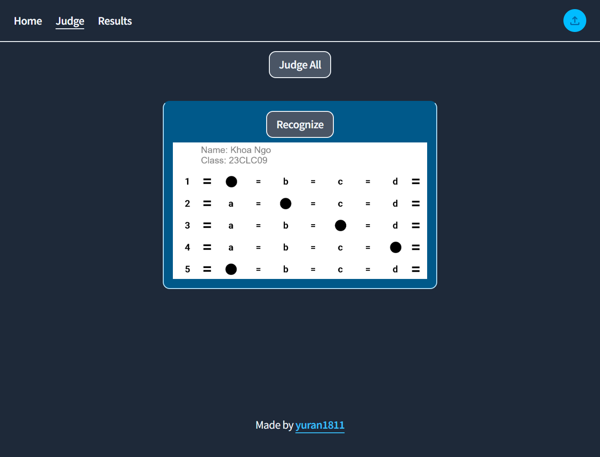
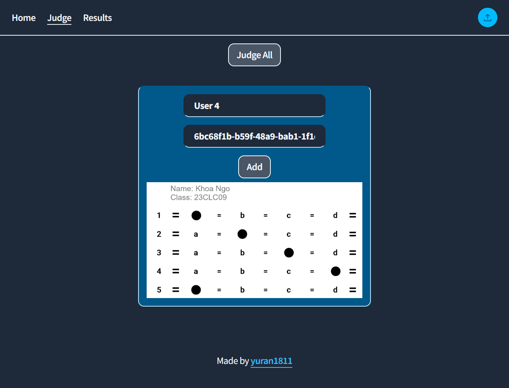
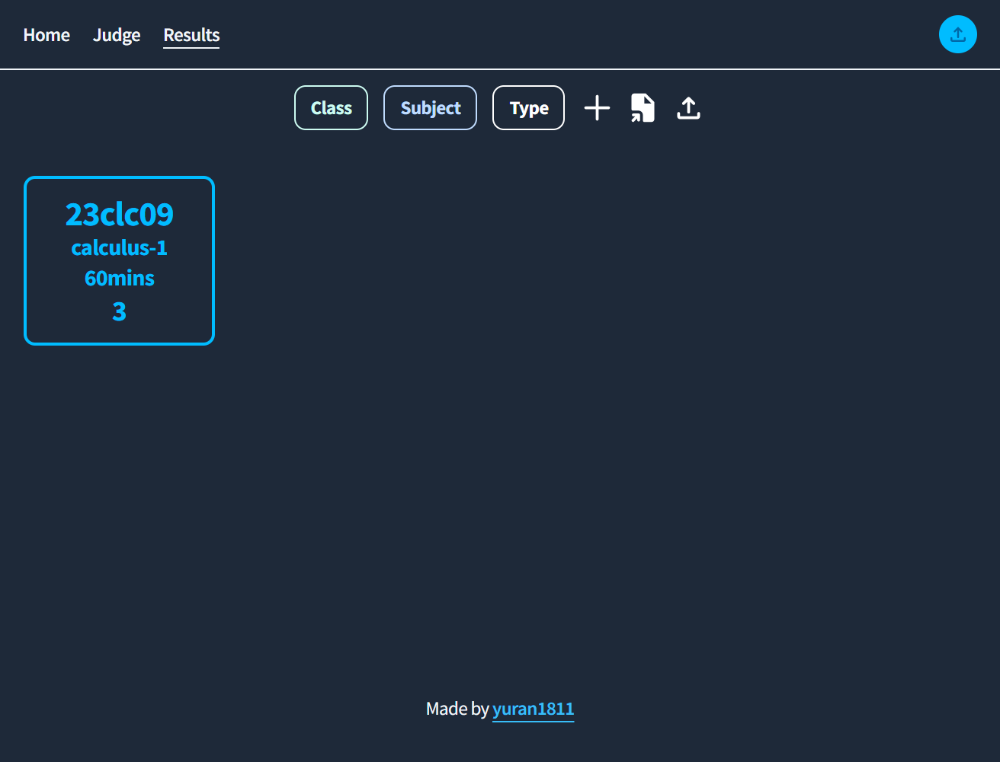
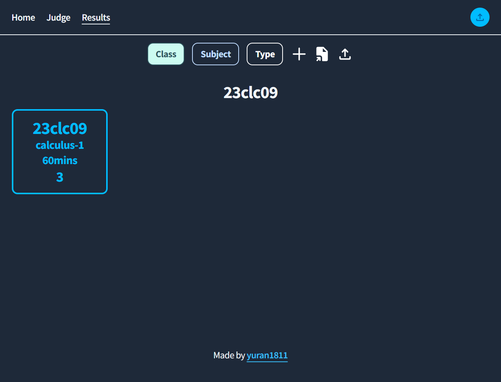
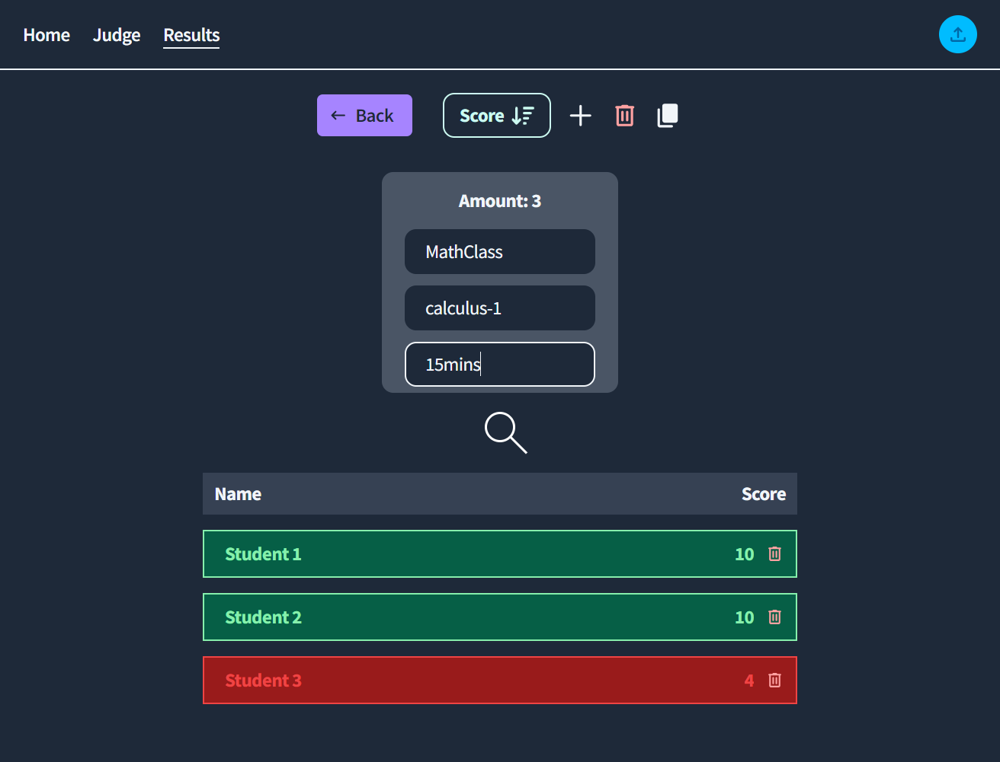

<h1 align="center">scanie</h1>
<p align="center" style="font-size:16px"><strong>An alternative of test judging</strong></p>
<p align="center">  
  
</p>

<p align="center">
  
  
  
  
  
</p>

<div align="center"><a href="http://scanie.vercel.app/" target="_blank">Live Demo</a></div>

## Features

- \>= 5s needed for judging
- Store the results and can be exported as `.xlsx` file
- Manage as many as results
- Filter groups follow fields, sort scores in each group
- **Todo**
  - Workflow :
    - Upload image -> recognize (Error of Not recognize -> Rejudge)
    - Add to group label for quicker action

## Tech Stack


- Other libs:
  - TesseractJS
  - uuid
  - react-toastify
  - react-hook-form
  - floating-ui
  - ...

## Screenshots

<div style="display:flex;gap:12px;justify-content:center">
    
    
</div>

<div style="display:flex;gap:12px;justify-content:center">
    
    
</div>

<div style="display:flex;gap:12px;justify-content:center">
    
    
</div>

## Quick Start

Follow these steps to set up the project locally on your machine.

**Prerequisites**

Make sure you have the following installed or downloaded on your machine:

- [Git](https://git-scm.com/)
- [Node.js](https://nodejs.org/en)

**Cloning the Repository**

```bash
git clone https://github.com/yuran1811/scanie.git
cd scanie
```

**Installation**

- Enable `pnpm` to build and run the project

```bash
corepack enable pnpm
```

Install the project dependencies:

```bash
pnpm install
```

**Running the Project**

```bash
pnpm dev
```

Open [http://localhost:5173](http://localhost:5173) in your browser to view the project.

## References

- [Preprocess Images for OCR](https://dev.to/mathewthe2/using-javascript-to-preprocess-images-for-ocr-1jc)
